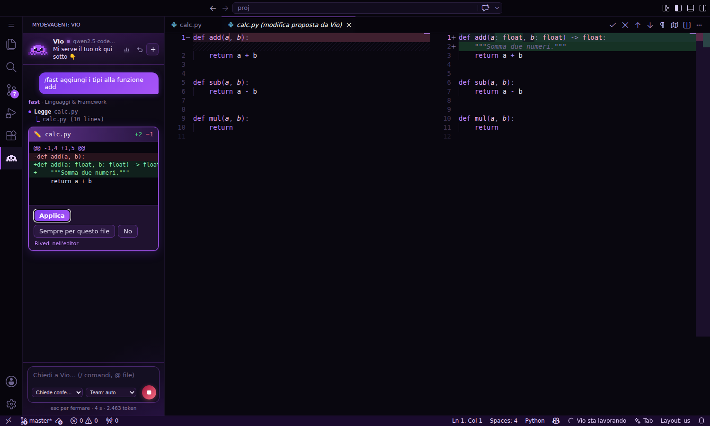
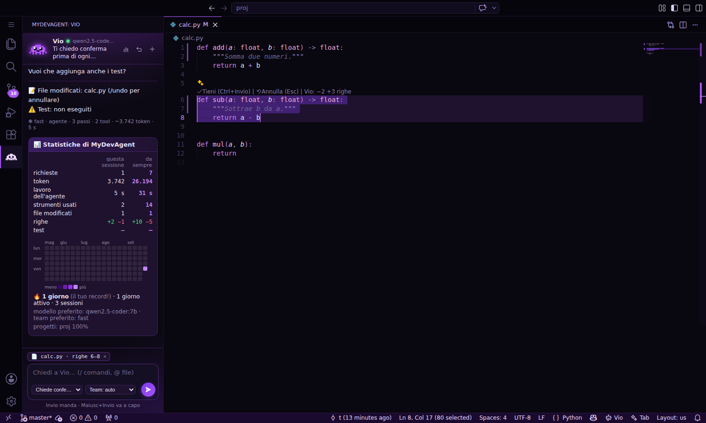
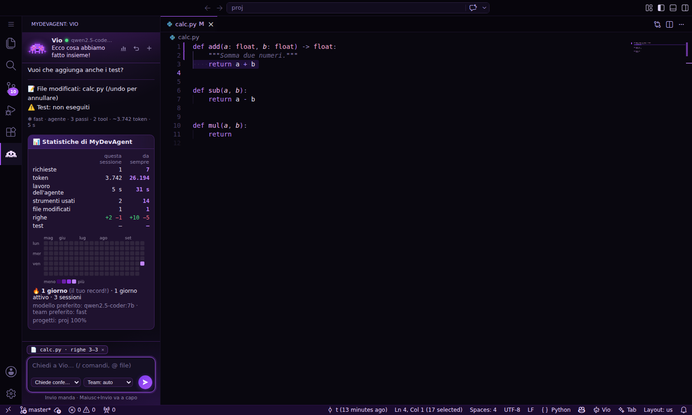

# MyDevAgent Studio

L'editor di codice con **Vio** come agente principale. È basato su [VSCodium](https://vscodium.com) (VS Code senza
telemetria) e usa [MyDevAgent](https://github.com/giovannisantorofrancesco2011-arch/MyDevAgent): tutto gira sul tuo
computer con Ollama, niente cloud e niente abbonamenti.

**[⬇ Scarica MyDevAgent-Studio-Setup.exe](https://github.com/giovannisantorofrancesco2011-arch/MyDevAgent/releases/latest/download/MyDevAgent-Studio-Setup.exe)** (Windows 10/11, 64 bit)



## Come si installa

1. Scarica **MyDevAgent-Studio-Setup.exe** e aprilo.
2. Windows potrebbe dire «Windows ha protetto il PC», perché l'installer non è firmato: clicca
   **Ulteriori informazioni** e poi **Esegui comunque**.
3. Lascia la spunta su «Installa anche Python, Ollama e MyDevAgent se mancano». Si apre una finestra che scarica
   quello che serve; la prima volta i modelli pesano qualche GB.
4. Apri MyDevAgent Studio, apri la cartella del tuo progetto e parla con Vio nella barra a sinistra.

Se qualcosa manca (Ollama spento, un modello non scaricato, MyDevAgent non trovato) Vio lo dice nella chat e ti dà il
pulsante per sistemarlo.

## Cosa sa fare

- **Chat con Vio** (Ctrl+L). Vio legge il progetto, modifica i file e lancia i test. Vede il file aperto e il codice
  selezionato; con `@` citi altri file, con `/` usi i comandi di MyDevAgent (`/stats`, `/undo`, `/diff`, `/plan`,
  i team di agenti…).
- **Ogni modifica si conferma.** Prima di toccare un file Vio apre il confronto prima/dopo nell'editor: ✓ per
  applicare, ✗ per rifiutare (anche spiegando perché). Con i permessi scegli quanto lasciarla fare da sola, e con
  `/undo` torni sempre indietro.
- **Ctrl+I** sul codice selezionato, o dove vuoi del codice nuovo: descrivi cosa vuoi e Vio lo scrive nel file.
  **Ctrl+Invio** per tenerlo, **Esc** per annullare.
- **Tab**: suggerimenti di codice mentre scrivi (meglio con il modello `qwen2.5-coder:1.5b-base`, Vio te lo propone).
- **/stats**: quanto hai lavorato con Vio, in questa sessione e da sempre, con il grafico dei giorni attivi.
- **Tema MyDevAgent Dark**, nero con sfumature di viola, e interfaccia in italiano.

| Ctrl+I | /stats |
|---|---|
|  |  |

## Scorciatoie

| Tasti | Cosa fa |
|---|---|
| Ctrl+L | Apre la chat di Vio |
| Ctrl+I | Modifica il codice selezionato (o ne scrive di nuovo) |
| Ctrl+Invio / Esc | Tiene / annulla la modifica di Ctrl+I |
| Tab | Accetta il suggerimento |
| Ctrl+Maiusc+Backspace | Ferma Vio mentre lavora |
| Invio / Maiusc+Invio | Manda il messaggio / va a capo |

## Impostazioni

In **File → Preferenze → Impostazioni**, cerca `mydevagent`:

| Impostazione | A cosa serve |
|---|---|
| `mydevagent.percorso` | Cartella di MyDevAgent, se non la trova da sola |
| `mydevagent.profilo` | Profilo di MyDevAgent da usare |
| `mydevagent.permessi` | Quanto Vio può fare senza chiedere |
| `mydevagent.team` | Team di agenti predefinito |
| `mydevagent.tab.attivo` / `tab.modello` / `tab.attesa` | Suggerimenti con Tab |
| `mydevagent.diffAutomatico` | Apre da solo il confronto prima/dopo |
| `mydevagent.salvaPrimaDiInviare` | Salva i file prima di ogni messaggio |

## Già usi VS Code?

Ogni release contiene anche `mydevagent.vsix`, la stessa estensione: in VS Code o VSCodium vai su
**Estensioni → … → Installa da VSIX**. Serve MyDevAgent installato.

## Com'è fatto

```
extension/            l'estensione (TypeScript): chat, conferme, Ctrl+I, Tab, tema
  src/bridge.ts       avvia `python -m mydevagent.cli bridge` e ci parla in JSON (una riga per messaggio)
  src/chat.ts         pannello di Vio, confronti prima/dopo, installazione e modelli
  src/inline.ts       Ctrl+I
  src/tab.ts          suggerimenti con Tab (Ollama /api/generate)
  media/              la pagina della chat, Vio animata, il markdown
  themes/             MyDevAgent Dark
  setup/              installa-mydevagent.ps1 (Python, Ollama, MyDevAgent)
studio/               tutto quello che trasforma VSCodium in MyDevAgent Studio
  build.ps1           scarica VSCodium, cambia nome e icone, aggiunge estensione e italiano, crea l'installer
  installer.iss       installer Inno Setup (per utente, senza permessi di amministratore)
  defaults/           impostazioni predefinite (tema, niente aggiornamenti di VSCodium)
  branding/           icone di Vio
tools/make_icons.py   rigenera le icone
```

Il comando `bridge` sta in MyDevAgent (`mydevagent/bridge.py`): l'estensione non ha una sua copia dell'agente, usa
quella installata.

## Sviluppo

```
cd extension
npm ci
npm run compile && npm test
npm run package          # crea mydevagent.vsix
```

Ogni push su questo branch fa partire la build Windows su GitHub Actions (`.github/workflows/studio.yml`), che
pubblica la release `studio-v<versione>` con l'installer. Per una nuova versione cambia `version` in
`extension/package.json`.

MIT. VSCodium e VS Code sono MIT; il pacchetto della lingua italiana è di Microsoft (MIT).
